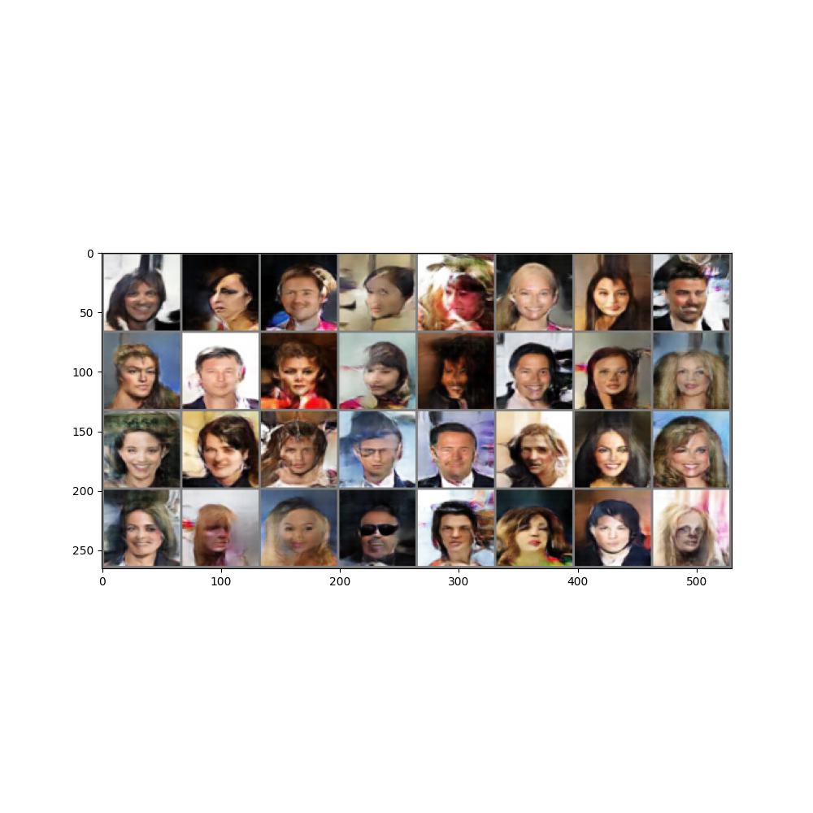

## GAN-QP 功能
构造一个新的 GAN 框架通常来说分为三步：
1）选择适当的概率散度函数
2）将其转换为对偶形式
3）进行 min-max 博弈

在本文中，证明了第一步是不必要的，**直接分析散度的性质以及在对偶空间内构造新的散度，最终找到了 WGAN 的可替代做法 GAN-QP**，同时证明 GAN-QP 效果优于 WGAN。
所以我们发现，GAN的过程其实就两步：1、通过max定义一个散度；2、通过min缩小两个分布的散度。

####  概念解释：
**散度：** 大部分 GAN (Generative Adversarial Networks) 基于确定的散度，**散度是一种函数来衡量随机变量 p、q 之间的分布相似性**。


## 模型架构
**模型架构与一般GAN完全一样，只是通过修改损失函数来保证训练的稳定性。**
**论文采用以下散度来构建GAN：**

**从理论上证明了该散度基不仅不会发生梯度消失问题，也不需要额外的L约束。**


## 损失函数

**令$T(x)=dis(x)$代入$(15)$式即可。**

**对于BiGAN-GP，只需要在BiGAN的基础上将损失函数改为以下形式即可：**

代码实现：

```c
d_loss = xz_real_score - xz_fake_score
d_loss = d_loss[:, 0]
d_norm = 10 * (K.mean(K.abs(x_real - x_fake), axis=[1, 2, 3]) + K.mean(K.abs(z_real - z_fake), axis=1))
d_loss = K.mean(- d_loss + 0.5 * d_loss**2 / d_norm)

g_loss = K.mean(xz_real_score - xz_fake_score) + 2 * K.mean(K.square(z_fake - z_fake_)) + 3 * K.mean(K.square(x_real - x_real_))
```
                        


## 结果
**生成的人脸：**


**生成的人脸与最相似的人脸对比：**
.png>)


**BiGAN-QP结果：**
.png>)
存在明显的模式崩溃情况，原因未知。

## 学习链接
**GAN-QP 代码(pytorch):** https://github1s.com/rahulbhalley/gan-qp.pytorch/tree/master

**BiGAN-QP代码(keras,python2):** https://github1s.com/bojone/gan-qp/blob/master/bigan-qp/bigan_qp_128.py#L169-L171

**论文精读：** https://kexue.fm/archives/6163

**较好理解的介绍：** https://www.jianshu.com/p/1100e76f82bb
**简略介绍：** http://t.csdnimg.cn/Y0O7l
