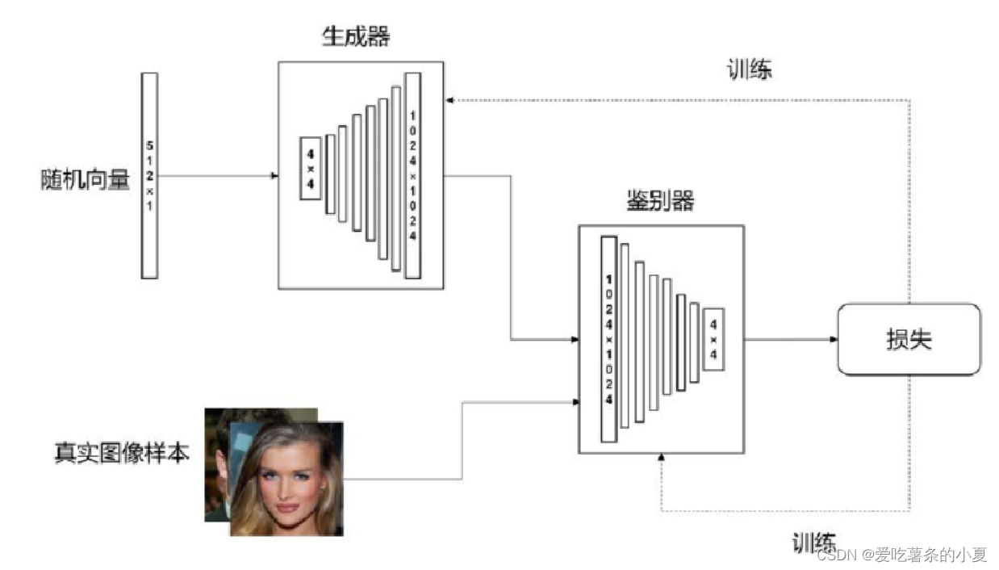
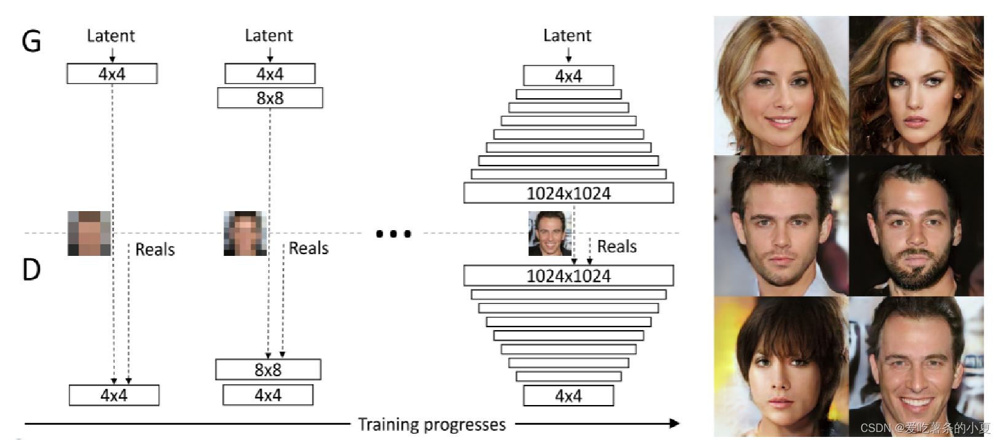
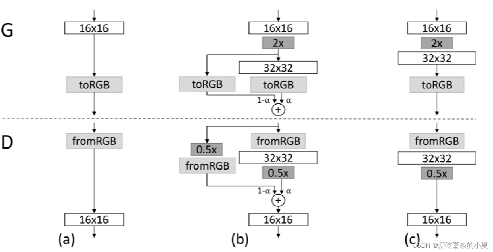
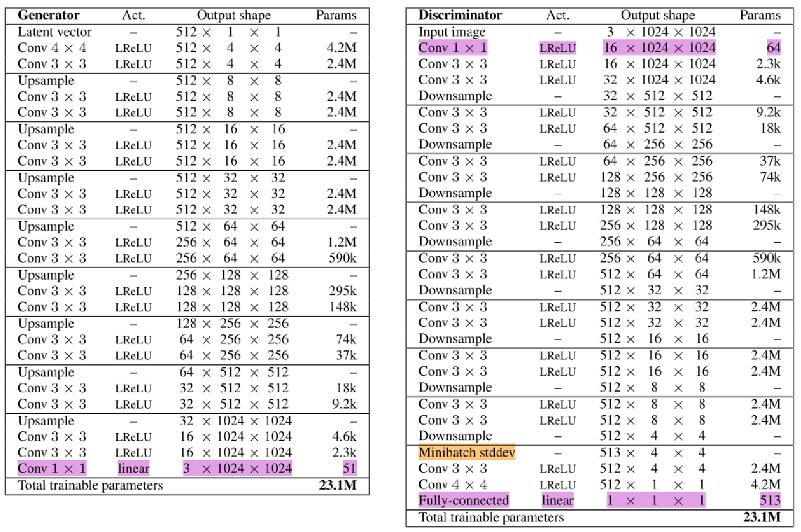
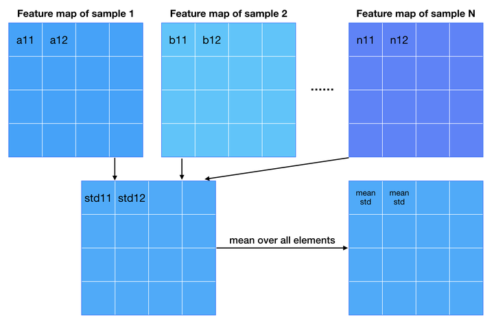
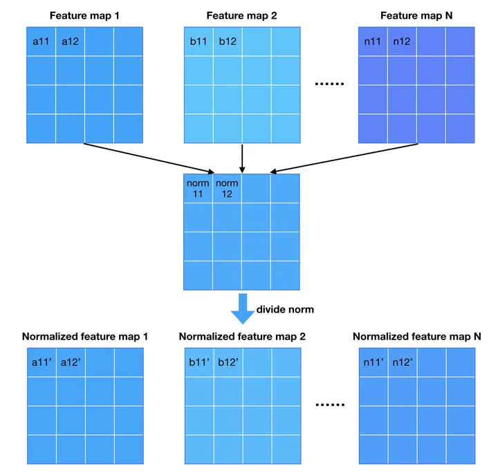
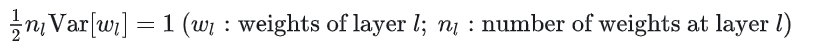
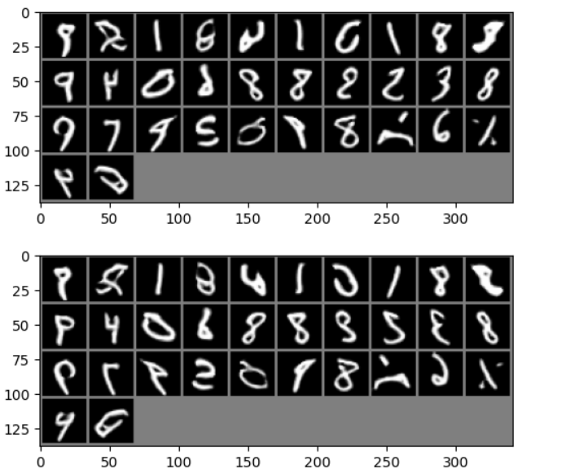

## ProGAN 功能
Pro-GAN()的优点：
1.**PG-GAN的渐进式增长允许生成非常高分辨率的图像**
2.稳定性：PG-GAN在**训练时更稳定**，避免了传统GAN训练中的一些问题，如模式崩溃。
3.多样性：通过小批量标准差和渐进增长，PG-GAN能够生成**多样性**更高的图像，而不会陷入生成相似图像的问题。
4.可控性：PG-GAN的平滑过渡和淡入技术提供了更大的控制能力，使用户可以**精确控制生成过程**，例如逐渐改变图像的细节和风格。

## 模型架构

PGGAN最初在训练生成器和判别器时仅使用4×4的极低分辨率图像训练，然后通过向网络中添加一个更高分辨率的层来逐步提高图像的分辨率。这种递增方式使得训练过程**首先学习图像分布的大尺度结构**，也就是低分辨率图像的基本特征，**然后随着学习到的分辨率的不断增加，将注意力转移到越来越多的尺度细节**。每次新的层被添加到网络中时，都会被平滑地淡入。

光滑过渡：
这张图说明了从16×16图像到32×32图像的过渡。

（a）假设已经是16×16的像素，toRGB层把16×16的特征转换为16×16的RGB图像，这个RGB图像是用来判别真假的图像，在判别器层用fromRGB把它转换为16×16的特征图。
（c）16×16的特征用了最近邻滤波将图4像分辨率扩展两倍变成32×32，判别器层用平均池化把$32*32$特征转换为$16*16$，但是这会造成一个突然的冲击

（b）所以为了平滑地增加这些层，生成32×32层有两条路径：左边这条直接把两倍的值加下来没有任何经过训练的参数；右边这条先经过32×32的卷积再相加。α刚开始是0，相当于没有右面这支，**慢慢的在训练过程中α逐渐变大从0扩展到1，扩展到1的时候，左边这只就失效了，光滑的过渡到了（c）** 。这种平滑的过渡机制稳定了PGGAN架构以给系统适应更高的分辨率的时间。

PGGAN 在1024 X 1024 时的完整的网络架构 

**增加生成图像多样性**：作者沿用improved GAN的思路，通过**人为地给Discriminator构造判别多样性的特征**来引导Generator生成更多样的样本。Discriminator能探测到mode collapse是否产生了，一旦产生，Generator的loss就会增大，通过优化Generator就会往远离mode collapse的方向走，而不是一头栽进坑里。
PG-GAN不引入新的参数，利用特征的标准差作为衡量标准。

**Normalization：** 第一种normalization方法叫**pixel norm**，它是local response normalization的变种。Pixel norm**沿着channel维度做归一化**，这样归一化的一个好处在于，feature map的每个位置都具有单位长度。

第二种normalization方法跟凯明大神的初始化方法[4]挂钩。He的初始化方法能够确保网络初始化的时候，随机初始化的参数不会大幅度地改变输入信号的强度。

作者走得比这个要远一点，他不只是初始化的时候对参数做了调整，而是动态调整。初始化采用标准高斯分布，但是每次迭代都会对weights按照上面的式子做归一化。作者argue这样的归一化的好处在于它不用再担心参数的scale问题，起到均衡学习率的作用(euqalized learning rate)。

## 结果

生成图像较清晰几乎没有噪点

## 学习链接：
**整体介绍：** http://t.csdnimg.cn/gp2om
**论文精读：** http://t.csdnimg.cn/2SpsW
**介绍：** https://zhuanlan.zhihu.com/p/30637133
**code:** https://vscode.dev/github/aladdinpersson/Machine-Learning-Collection

