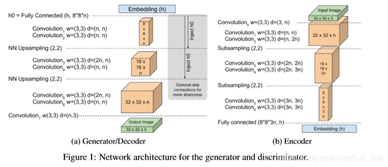
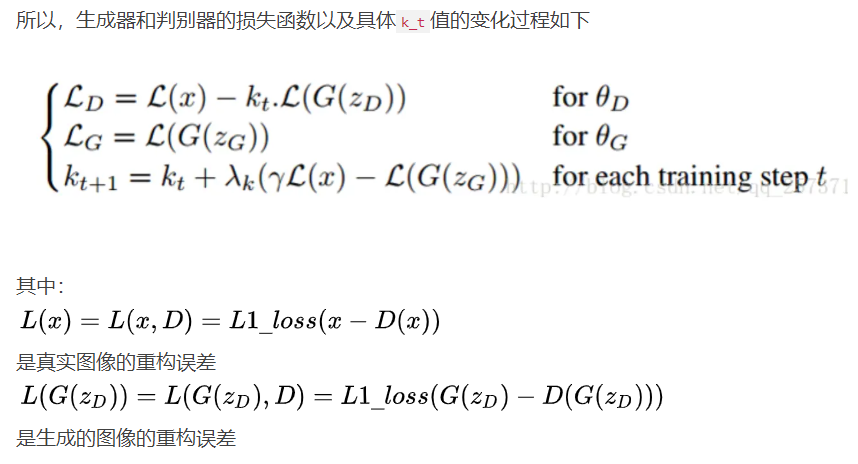
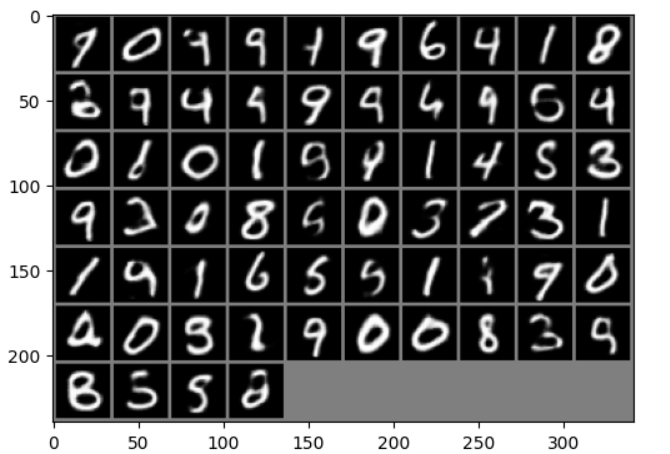

## BEGAN功能
一个简单且鲁棒性更好的 GAN 架构，使用**标准的训练步骤实现了快速、稳定的收敛**，生成的图像质量更高
提出了一种均衡的概念，使得判别器和生成器在训练过程中保持平衡
一种控制在图像多样性与视觉质量之间权衡的新方法
提出了用于衡量收敛的方法
提出了一个由Wasseratein loss衍生而来的配套的loss

## 模型架构

**在BEGAN中，判别器并不是直观的输出判别的结果，而是一个encoder-decoder,其中Decoder部分和生成器一致**

## 损失函数

这个$k_t$的变量是不断变化的，其一开始是一个很小的小数，比如0.0001，所以在一开始生成器的结果还不是很好时，几乎就是真实图像在起作用。当训练了一段时间之后，k_t就会慢慢增加。

另一种理解方式，假设真假图像经过判别器（特征提取器）重构后得到的和原图的误差分布分别为A'和B'

那么**判别器D的目的就是让A'和B'的尽可能的相差大一点**，也就是让特征提取器可以更好的分辨真假图像

然后**生成器G的目的则是让假图像经过判别器与原图的误差分布B'尽可能小**，也就是让A'和B'尽可能相差的小一点

在论文中证明了A'和B'都是满足正态分布的，所以A'和B'的距离可以用
Wasserstein距离来得到

大概的概括一下原理就是：根据Wasserstein距离，来匹配自编码器的损失分布。并采用神经网络结构，**在训练中添加额外的均衡过程，来平衡生成器和判别器**.

## 结果

**模型架构简单，结果良好，且逐渐收敛。**

## 学习链接：
**论文翻译：** http://t.csdnimg.cn/2Aa2z
**易于理解的解读：** https://www.jianshu.com/p/a170055b742a
**论文解读：** http://t.csdnimg.cn/iJdoT
**代码：** https://github1s.com/eriklindernoren/PyTorch-GAN/blob/master/implementations/began/began.py