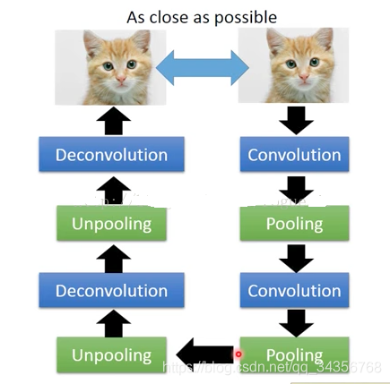

## 1.模型架构
对于自编码器，其结构可分为编码器(encoder)与解码器(decoder)两部分。
encoder部分:可以是卷积、池化、全连接等层组成的一个神经网络（为了缩小维度，卷积一般采取下采样，或将其中矩阵转成1维张量，再进行全连接，全连接层神经元节点个数逐层逐渐减少），并且输出维度与输入相比会小很多；
decoder部分，其结构可以为卷积、全连接等各层的组合（为了增加维度，卷积通常采取上采样，或者全连接层神经元节点个数逐层逐渐增加），decoder部分将encoder部分的输出作为输入，最终的输出与输入的维度完全一致。
网络训练的关键是使输入与输出尽可能相同(损失尽可能小)，所以损失函数中分别为该数据与该数据通过自编码器得到的输出。训练结束后，某一数据输入自编码器，此时Encoder的输出embedding即为该数据的表征。
它主要用于数据降维、压缩以及获取低维度表征等。

缺点：我们的目标是在隐空间随机选择一个点，传给解码器，都能得到很真实的图像，但事实上，各个数字的对应隐空间存在很大的间隙，存在一些隐空间没有定义。
## 2.损失函数

可使用原始图片与重建图片之间的均方根误差（RMSE）。

关于RMSE和MSE的对比:
MSE的值越小，说明模型预测的结果越接近真实值，模型的性能越好。MSE的值受到异常值的影响比较大，因为它是误差的平方，而平方会放大异常值的影响。

与MSE相比，RMSE的值受到异常值的影响相对较小，因为它对误差值取了平方根，从而减小了异常值的影响。

