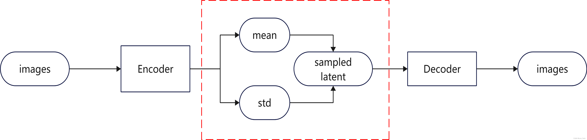
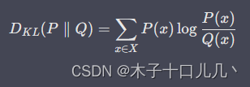
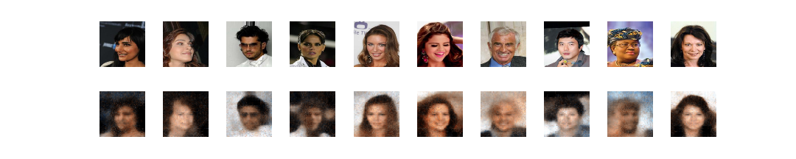
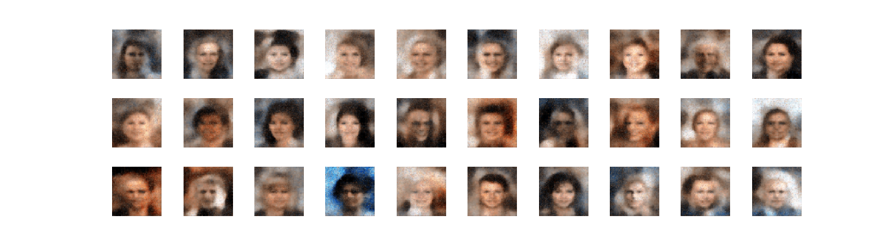

## 1.模型架构
AE结构只能对图像进行压缩和还原，并不能生成新的图像。VAE通过把latent概率化，从而可以在特定的概率分布中获取一定的随机性。

VAE将latent表达为高斯的概率分布，同时通过网络去自动学习平衡图像生成的精确度和概率分布的拟合度，这两者可以分别用MSE和KL散度来计算。之所以使用高斯分布，是因为高斯分布可以去累加映射得到任何的数据分布，同时高斯分布可以通过参数重整化转换为标准正态分布的线性表达，因此VAE中的latent中包括了高斯分布的均值和标准差。具体的流程图如下：

VAE要求对于latent在某个高斯分布上随机采样时都得到类似的输出。
引入噪声，使得图片的编码区域得到扩大，从而掩盖掉失真的空白编码点。

## 学习链接：
http://www.gwylab.com/note-vae.html

## 2.损失函数

损失函数方面，除了必要的重构损失外，VAE还增添了一个损失函数KL散度，这同样是必要的部分，因为如果不加的话，整个模型就会出现问题：为了保证生成图片的质量越高，编码器肯定希望噪音对自身生成图片的干扰越小，于是分配给噪音的权重越小，这样只需要将方差赋为接近负无穷大的值就好了。所以，第二个损失函数就有限制编码器走这样极端路径的作用。

KL散度（Kullback-Leibler Divergence）一般用于度量两个概率分布函数之间的“距离”。

 KL散度的典型应用场景如下：假设某优化问题中, P(X) 是真实分布（true distribution）， Q(X) 是一个用于拟合 P(X) 的近似分布（approximate distribution），可以尝试通过修改Q(X) 使得二者间的KL[P(X)∥Q(X)] 尽可能小,来实现用 Q(X) 拟合P(X) 。

torch实现：
import torch.nn.functional as F
kl_div = F.kl_div(q_tensor.log(), p_tensor, reduction='batchmean')

## 3.结果

重建人脸

生成的新人脸
