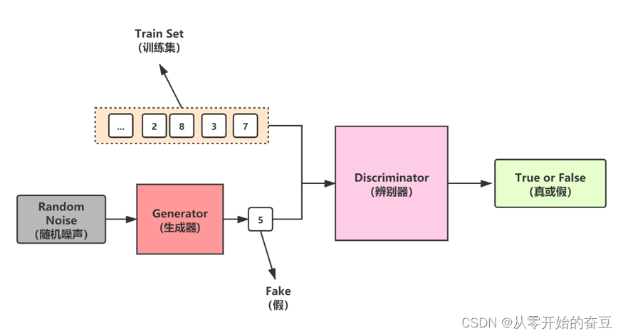

## 1.模型架构

## 2.损失函数
生成器损失：是指生成器试图生成更真实数据的损失，一般为二元交叉熵。
判别器损失：是指判别器试图更好地识别真实数据和假数据的损失。判别器损失通常使用判别器识别真实数据和假数据的损失之和来计算。

## 缺点：
损失震荡，训练不稳定。
模式收缩，生成器倾向于找到一个能够蒙蔽判别器的模型。
损失函数与生成质量无关，无法根据模型损失监控模型训练。
需要调整大量超参数。