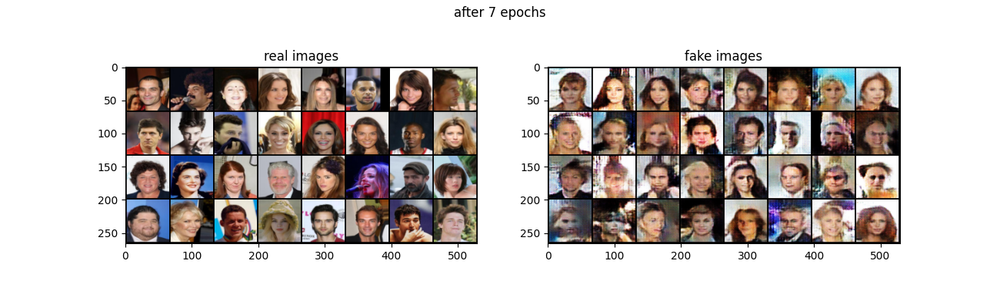

## 1.模型架构
模型架构与原始GAN类似。
算法实现相比原始GAN的算法实现流程却只改了四点：
1.判别器最后一层去掉sigmoid
2.生成器和判别器的loss不取log
3.每次更新判别器的参数之后把它们的绝对值截断到不超过一个固定常数c
4.不要用基于动量的优化算法（包括momentum和Adam），推荐RMSProp

优点：
1.彻底解决GAN训练不稳定的问题，不再需要小心平衡生成器和判别器的训练程度
2.基本解决了collapse mode的问题，确保了生成样本的多样性
3.训练过程中终于有一个像交叉熵、准确率这样的数值来指示训练的进程，这个数值越小代表GAN训练得越好，代表生成器产生的图像质量越高
4.以上一切好处不需要精心设计的网络架构，最简单的多层全连接网络就可以做到

## 2.损失函数
根据原始GAN定义的判别器loss，我们可以得到最优判别器的形式；而在最优判别器的下，我们可以把原始GAN定义的生成器loss等价变换为最小化真实分布与生成分布之间的JS散度。我们越训练判别器，它就越接近最优，最小化生成器的loss也就会越近似于最小化$P_r和P_G$之间的JS散度

Wasserstein距离相比KL散度、JS散度的优越性在于，即便两个分布没有重叠，Wasserstein距离仍然能够反映它们的远近。

## 学习链接：
https://link.csdn.net/?target=https%3A%2F%2Fzhuanlan.zhihu.com%2Fp%2F25071913

## 结果
