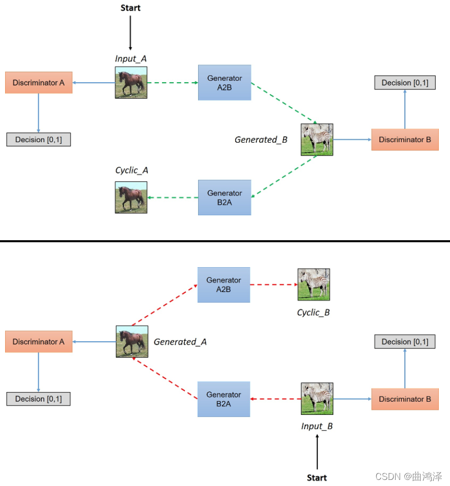
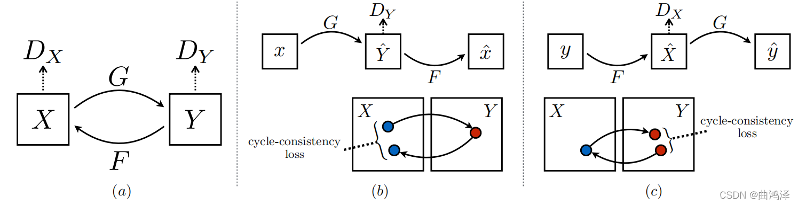
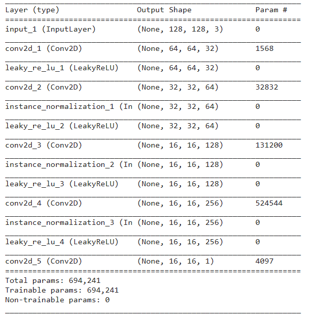
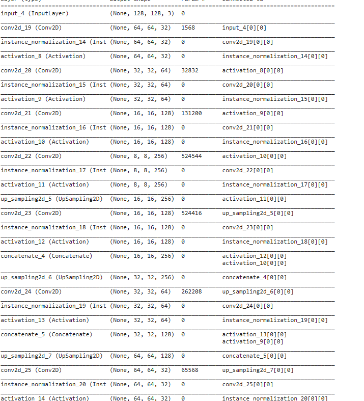
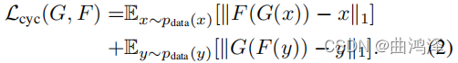
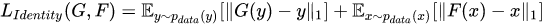

## 模型架构

 这张图是论文中给出的，它的意思就是X（马）经过生成器G（G_A2B）来生成带有原来形状的斑马图片，紧接着我在用另一个生成器F（G_B2A）来将我刚刚生成的斑马图片还原成之前马的样子，最后两个鉴别器分别来判断生成的斑马和真实的马的真假。反过来原理也是一样，我将Y（斑马）放入生成器（G_B2A）中来生成假的带有原来形状的马，紧接着我在用另一个生成器（G_A2B）把生成出来的马来变成原来形状的斑马，紧接着两个鉴别器分别来判别生成的马和真实的斑马的真假。这就是cyclegan的原理。

判别器：

生成器

## 损失函数

重建Loss：希望生成的图片Gba(Gab(a))与原图a尽可能的相似。
判别Loss：生成的假图片和原始真图片都会输入到判别器中。公式为0,1二分类的损失
循环损失（Cycle Consistency Loss）：

Identity loss:

生成器G用来生成y风格图像，那么把y送入G，应该仍然生成y，只有这样才能证明G具有生成y风格的能力。因此G(y)和y应该尽可能接近。根据论文中的解释，如果不加该loss，那么生成器可能会自主地修改图像的色调，使得整体的颜色产生变化。

## 学习链接
https://blog.csdn.net/qq_41496108/article/details/120906062?ops_request_misc=&request_id=&biz_id=102&utm_term=cyclegan&utm_medium=distribute.pc_search_result.none-task-blog-2~all~sobaiduweb~default-8-120906062.nonecase&spm=1018.2226.3001.4187

https://blog.csdn.net/frighting_ing/article/details/123573395?ops_request_misc=%257B%2522request%255Fid%2522%253A%2522171098654616800192227708%2522%252C%2522scm%2522%253A%252220140713.130102334..%2522%257D&request_id=171098654616800192227708&biz_id=0&utm_medium=distribute.pc_search_result.none-task-blog-2~all~baidu_landing_v2~default-1-123573395-null-null.142^v99^pc_search_result_base9&utm_term=cyclegan%20模型架构&spm=1018.2226.3001.4187

