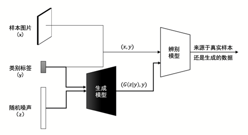
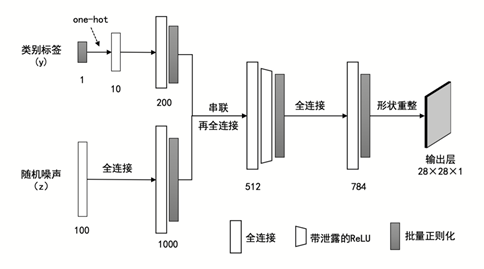
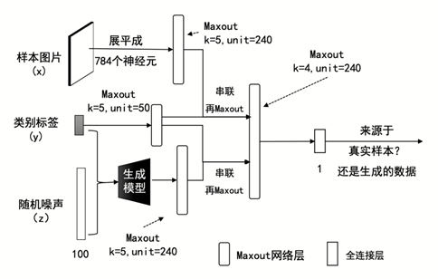
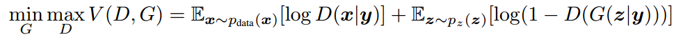

## 模型架构
CGAN 模型架构

CGAN 生成模型：

生成器，输入的是c和z，z是随机噪声，c是条件，输出是生成的虚假图片。

CGAN 判别模型

## 损失函数

CGAN添加的额外信息y只需要和x与z进行合并，作为G和D的输入即可，剩余步骤和一般GAN类似。

## 学习链接：
https://blog.csdn.net/weixin_40920183/article/details/118216236?ops_request_misc=&request_id=&biz_id=102&utm_term=CGAN&utm_medium=distribute.pc_search_result.none-task-blog-2~all~sobaiduweb~default-7-118216236.142^v99^pc_search_result_base9&spm=1018.2226.3001.4187

