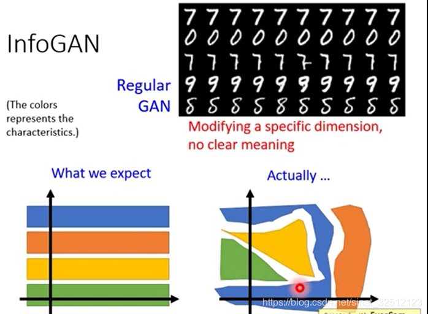
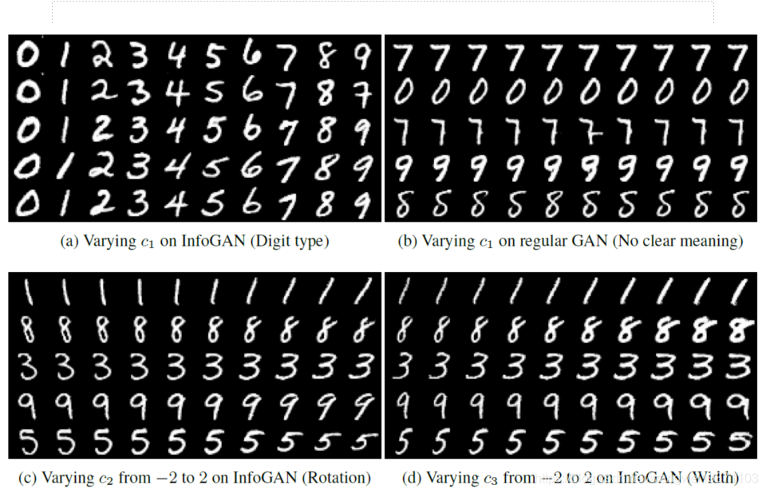
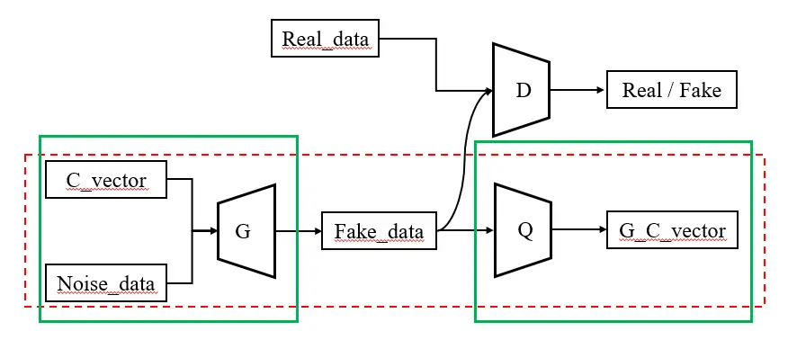
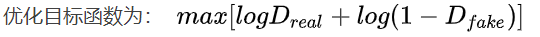
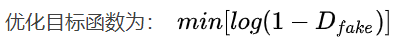
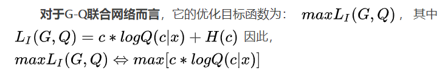
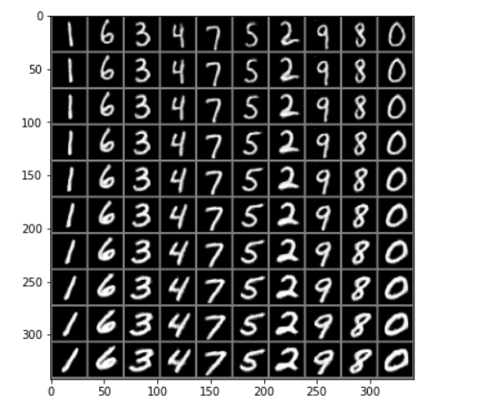

## InfoGAN功能
原始Gan没有对生成器如何使用噪声做出约束，训练出来的生成器，对于z的每一个维度不能够很好的对应到相关的语义特征。而infoGAN可以找到这种**语义特征**。

对于一般GAN，**噪声与生成图像的关联性不明显**，而我们**希望让这种关联变得明显**，从而能够通过更改输入得到相应期望的图片。

可以看到通过调节参数c，生成的数字可以分类、旋转、调整宽度。相当于是说通过了**无监督**的形式，**学习到了参数和特征的分布关系**。

## 模型架构

**生成器的随机噪声分成了两部分**：一部分是随机噪声Z， 另一部分是由若干**隐变量拼接而成的latent code c**。其中，c会有先验的概率分布，可以**离散**也可以**连续**，用来代表生成数据的不同特征。例如：对于MNIST数据集，c包含离散部分和连续部分，离散部分取值为0~9的离散随机变量（表示数字），连续部分有两个连续型随机变量（分别表示倾斜度和粗细度）。

为了让隐变量c能够与生成数据的特征产出关联，作者**引入了互信息来对c进行约束**，因为c对生成数据G(z, c)具有可解释性，那么c和G(z, c)应该具有较高的相关性，即它们之间的互信息比较大。互信息是两个随机变量之间依赖程度的度量，**互信息越大就说明生成网络在根据c的信息生成数据时，隐编码c的信息损失越低，即生成数据保留的c的信息越多。**

模型架构中其中判别器D和Q共用所有卷积层，只是最后的全连接层不同。从另一个角度来看，**G-Q联合网络相当于是一个自编网络，G相当于一个编码器，而Q相当于一个解码器**，生成数据Fake_data相当于对输入隐变量C_vector的编码。

## 损失函数

**对于判别器D：**

**对于生成器G：**

**对于G、Q联合网络：**

## 学习链接
**模型架构介绍：** https://www.jianshu.com/p/fa892c81df60
**损失函数介绍：** https://mp.weixin.qq.com/s?__biz=MzIwMTc4ODE0Mw==&mid=2247492415&idx=1&sn=a359e72ee99555f7a2fb4e21b2ad51db

## 结果：

**数字随c1变大顺时针旋转**