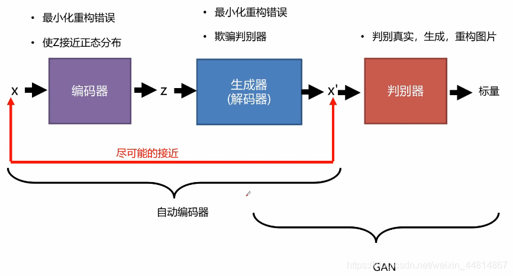
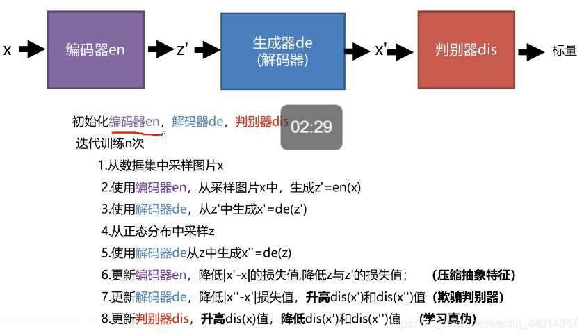
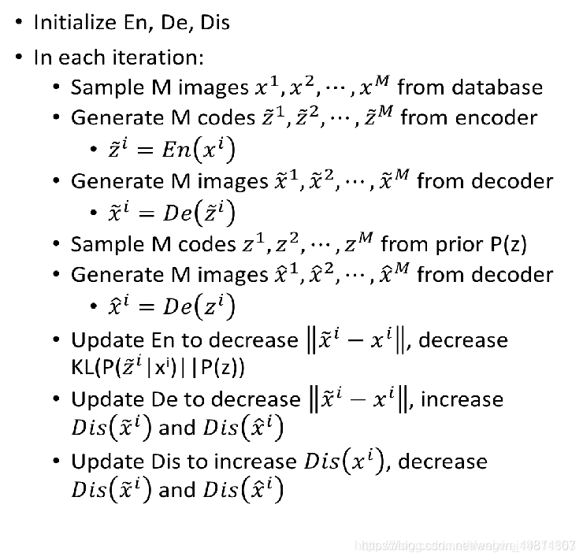
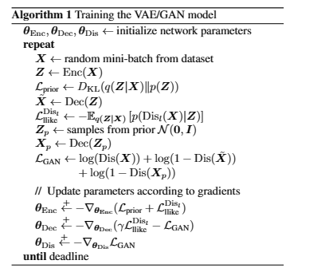

## 1.VAE-GAN 功能：
结合VAE和GAN的优点，可以看做用GAN强化VAE,也可以看作是VAE强化GAN。
VAE没有inout和output的loss,所以生成图像会很**模糊**，加上判别器后，会**让生成的图片更加真实**。
GAN中的生成器从没看过真正的图片长什么样，需要花大量时间去训练，才能让G学会生成足够真实的图片，加上编码器后，学习速度回快很多。

## 2.模型架构

**自动编码器是将输入数据压缩到高度抽象的特征空间**然后进行重构的过程。一开始对于输入数据X进行压缩重构成一个向量z，在进行解码器进行解码，使输出和输入尽可能接近。这一步的操作的目的是为了更好的欺骗判别器，其余部分跟传统的GAN 网络是一致的。

编码器要做的就是让P(z|x)逼近分布P(z)，比如标准正太分布，同时最小化生成器(解码器)和输入x的差距。
生成器(解码器)要做的就是最小化输出和输入x的差距，同时又要骗过判别器。
判别器要做的就是给真实的高分，跟P(z)采样生成的和重建的低分。

## 3.损失函数
**编码器损失：** 重建损失，kl损失
**生成器(解码器)损失：** 欺骗判别器，降低解码结果和重采样后解码结果的差别
**判别器损失：** 判别损失

## 学习链接：
http://t.csdnimg.cn/UhXRh

https://www.bilibili.com/video/BV1j4411s77h/?share_source=copy_web&vd_source=2b8655e2bed7b94d772fed5f5a577565

**code1**:(网络较简单，结果相对较差)
https://github1s.com/jiayoujiayoujiayoua/Deep-Generative-Network/tree/master

**code2**:(存在backward问题，可能为版本问题)
https://github1s.com/gm3g11/VAE_GAN_pytorch/blob/master/main.py#L139