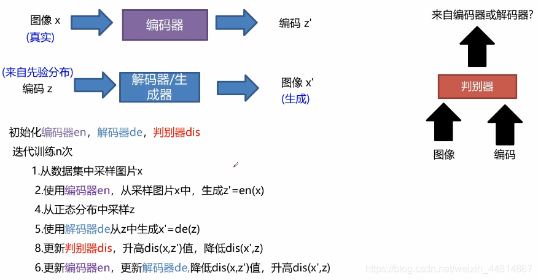
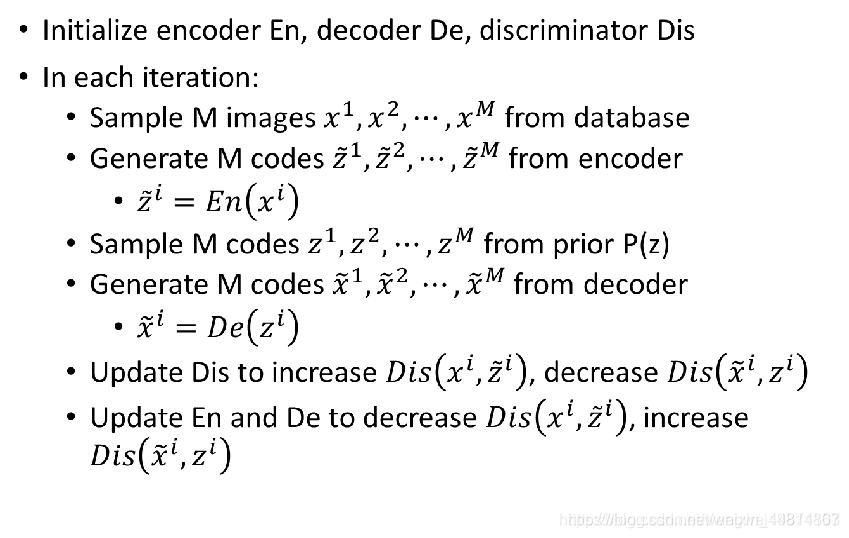
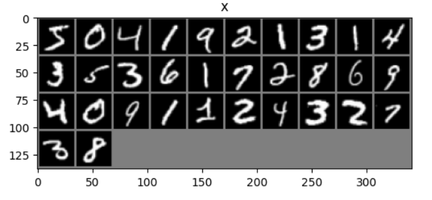
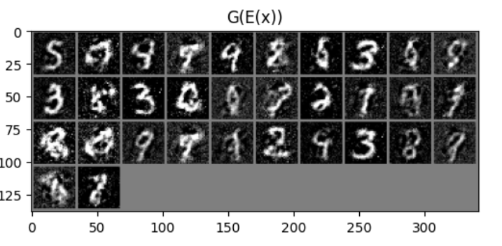
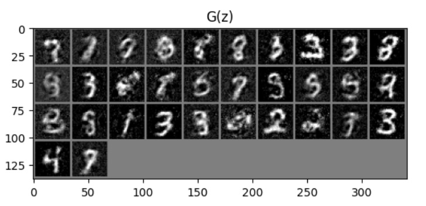

## Bi-GAN 功能
**一种结合GAN和AE的方法**
## 模型架构
BiGAN就是双向GAN的意思，这里的判别器与上面介绍的判别器不一样，这里的判别器接收的是**图像和编码**，**判别图像和编码是来自编码器还是解码器。**

算法思想：将编码器和解码器分开，但是加一个判别器，将他们的输入和输出同时作为判别器的输入，然后区分是来自编码器还是解码器，**如果无法分别来自哪个，就说明编码器的输入图片和解码器生成的图片很接近**，编码器输出的z和解码器输入的z很接近，目的就达到了。
简单的原理就是将编码器看成一个P(x,z)分布，将解码器看成Q(x,z)分布，通过判别器，让他们的差异越来越小。

**BiGAN和AE的最理想结果是一致的，即x被重新解码后与x完全一致，但在实际情况中，AE会生成图像会较模糊**。

## 损失函数

**判别器：** 判别损失，一般将编码器结果视为真样本，解码器结果视为假样本。
**编码器、解码器：** 和判别器相反

## 结果

**生成图像较模糊**，重构图像和原图的类别和一些特征基本一致，但存在细微的不同。模型并不是学会了一个逐像素对应的一一映射，而是一个整体看上去差不多的清晰的重构结果。

## 学习链接：
**代码：** https://github.com/eriklindernoren/Keras-GAN