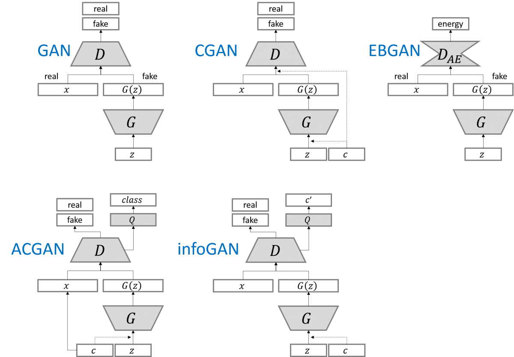
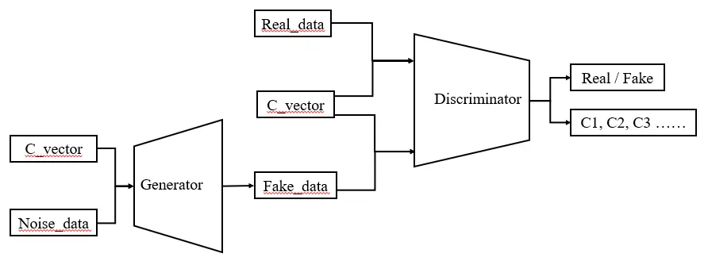
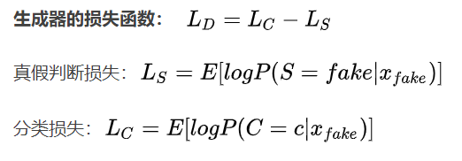
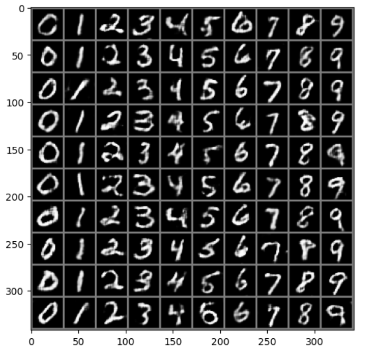
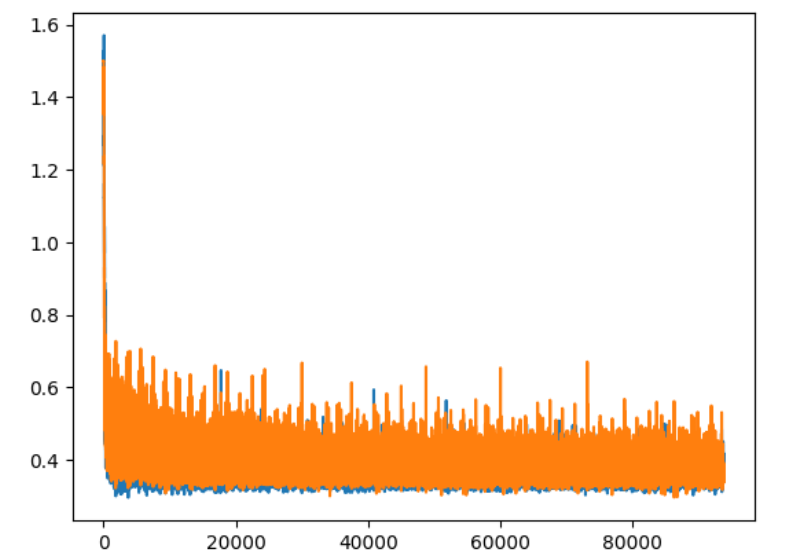

## ACGAN功能
使用**有标签的数据集**应用在生成对抗网络可以有效的**增强现有的生成模型**。形成了两种优化的思路。

第一种是cGAN中**使用了辅助的标签信息来增强原始GAN，对生成器和判别器均使用标签数据来训练。实现了生成模型具备特定条件数据的能力**。同时也有研究表明，cGAN的生成图像质量比传统的方式更优，当标签信息更丰富的时候。效果也随之升高。

第二种是SGAN**从另一个方向利用辅助标签信息。利用判别器或分类器一端来重建标签信息，从而提升GAN的生成效果**。研究发现，当让模型处理额外信息时，反而会让模型本来的生成任务完成的更好。优化后的分类器可以有效提升图像的综合质量。

上面是从两个角度思考标签数据对于GAN的优化，将这两种思想结合就可以建立辅助分类GAN。我们称之为ACGAN。通过对结构的改造将上面的两个优势结合在一起，利用辅助标签信息产生更高质量的生成样本。

## 模型架构

**CGAN**的判别器输入，真假数据集都拼接了labels。而**ACGAN**在判别器输入时，**真假数据集都没有拼接labels**，而是尝试重建label.

## 损失函数
 对于判别器而言，既希望分类正确，又希望能正确分辨数据的真假；对于生成器而言，也希望能够分类正确，当时希望判别器不能正确分辨假数据。
 

 

## 结果

**训练过程明显比cGAN和GAN稳定**

## 学习链接：
**1.** http://t.csdnimg.cn/9BNvg
**2.** https://www.jianshu.com/p/aef29fe51c73
**3.** http://t.csdnimg.cn/mUQim